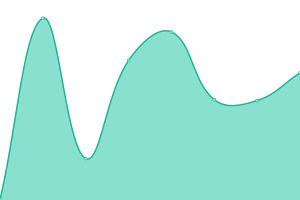

This repository contains the open-source uptime monitor and status page for [Agile Consulting and Engineering](https://hive.gov.sg), powered by [Upptime](https://github.com/upptime/upptime).

## STATUS

With [Upptime](https://upptime.js.org), you can get your own unlimited and free uptime monitor and status page, powered entirely by a GitHub repository. We use [Issues](https://github.com/gdsace/status/issues) as incident reports, [Actions](https://github.com/gdsace/status/actions) as uptime monitors, and [Pages](https://gdsace.github.io/status) for the status page.

<!--start: status pages-->
<!-- This summary is generated by Upptime (https://github.com/upptime/upptime) -->
<!-- Do not edit this manually, your changes will be overwritten -->
<!-- prettier-ignore -->
| URL | Status | History | Response Time | Uptime |
| --- | ------ | ------- | ------------- | ------ |
|  [code](https://code.gov.sg) | 🟩 Up | [code.yml](https://github.com/gdsace/status/commits/HEAD/history/code.yml) | 

 1279ms
     
 | 

<a href="https://gdsace.github.io/status/history/code">74.25%</a>
    

|  [blog](https://blog.gds-gov.tech) | 🟩 Up | [blog.yml](https://github.com/gdsace/status/commits/HEAD/history/blog.yml) | 

 1268ms
     
 | 

<a href="https://gdsace.github.io/status/history/blog">70.72%</a>
    

|  [qv](https://peer-nomination.gahmen.io) | 🟩 Up | [qv.yml](https://github.com/gdsace/status/commits/HEAD/history/qv.yml) | 

 425ms
     
 | 

<a href="https://gdsace.github.io/status/history/qv">100.00%</a>
    

<!--end: status pages-->

[**Visit our status website →**](https://gdsace.github.io/status)undefined
